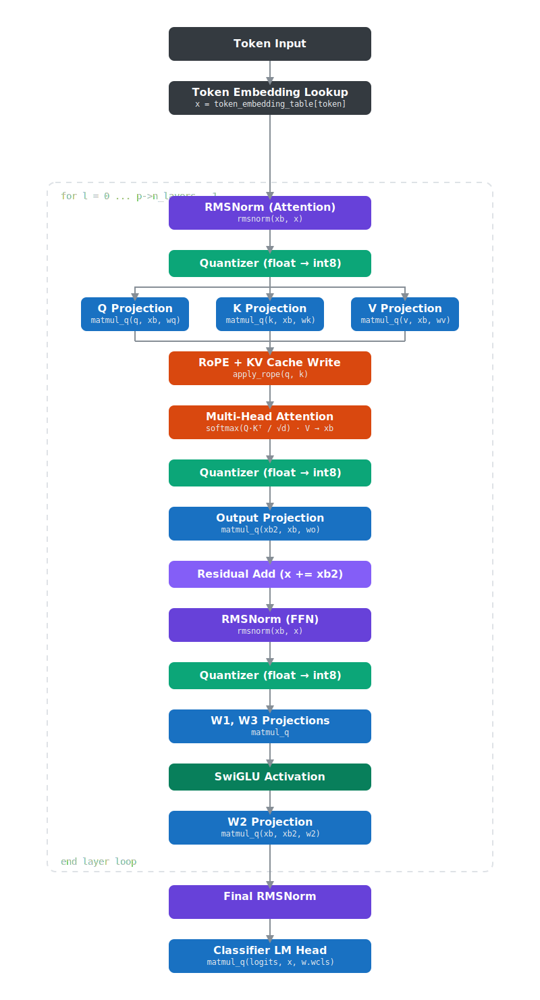
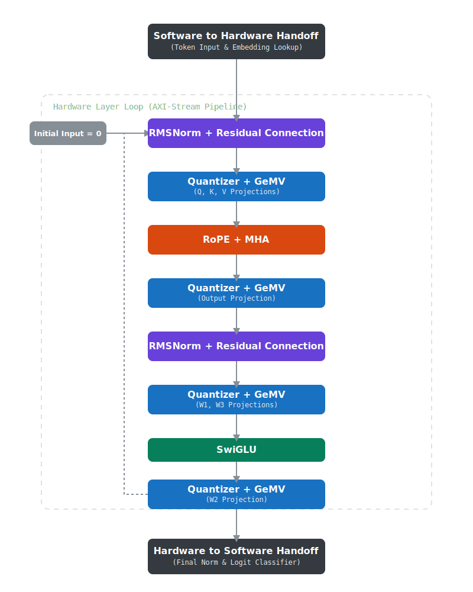
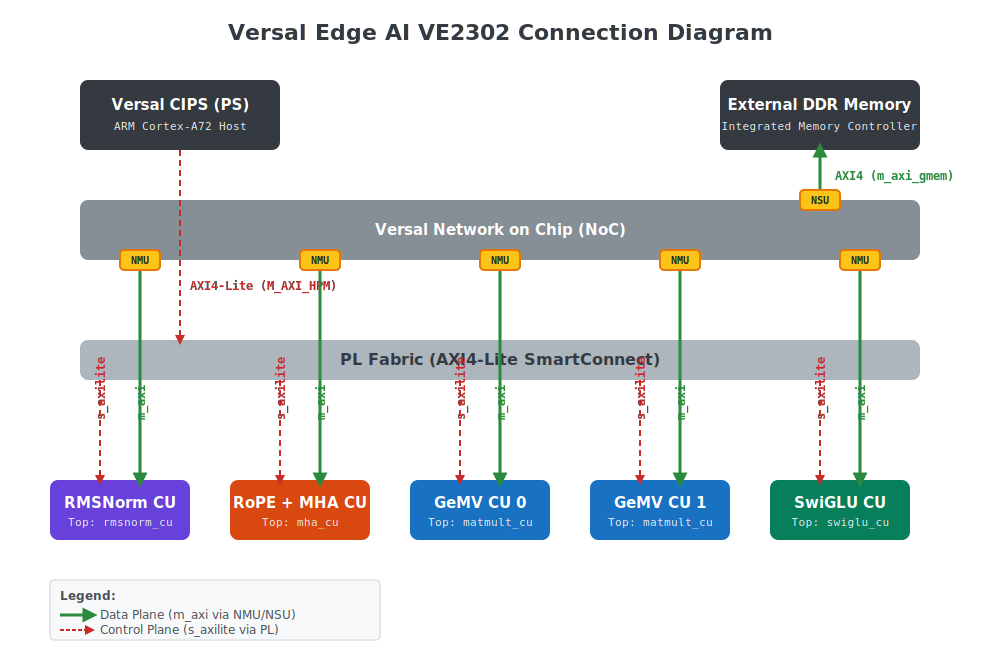
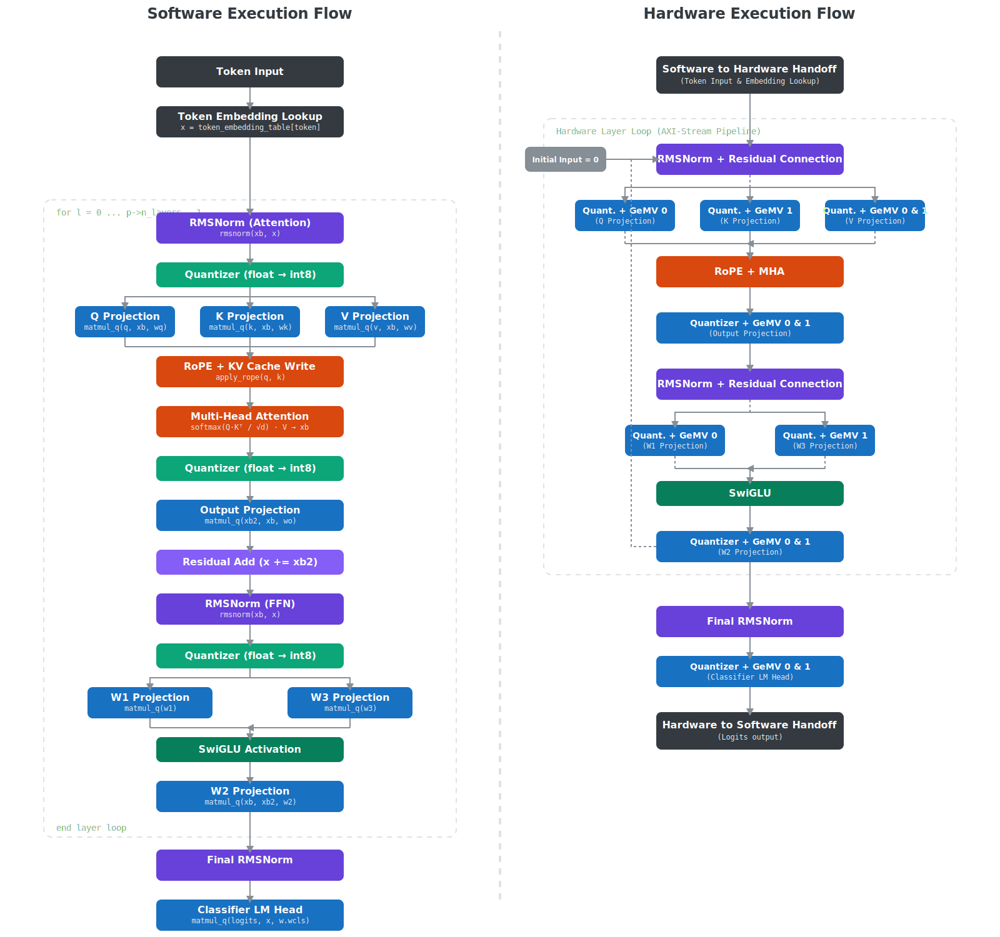

# HLS_llama

## Introduction

An HLS variant of Karpathy's Llama2.c project. The hardware and software here is under active development, and is apart of my thesis research for UTD. 

The application of an large language model on a field programmable gata array is not a new concept. 

Shown here are four hardware accelerators used to do all computations done in the transformer pass of the llama2 LLM using the relatively simple int8 compression. The llama2.c repo was used as a reference and starting point for the compute units developed, with careful considerations and refinement on the implementation to maximize thoughput and take advantage of hardware. In the *Forward* function call of Karpathy's [llama2.c/runq.c](https://github.com/karpathy/llama2.c/blob/master/runq.c) software flow on the left, you can see the implementation of the transformer. 

  
  

PARDON THE DUST; A WORK IN PROGRESS.