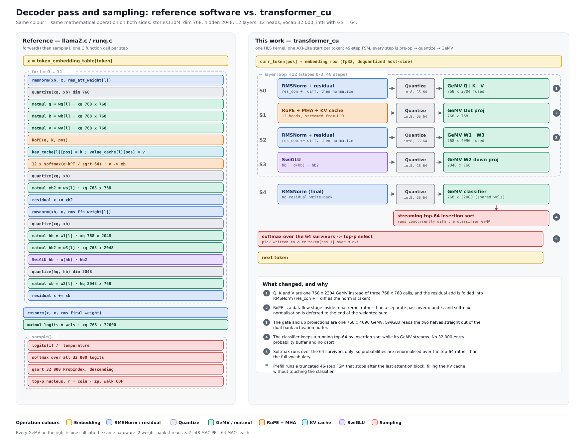
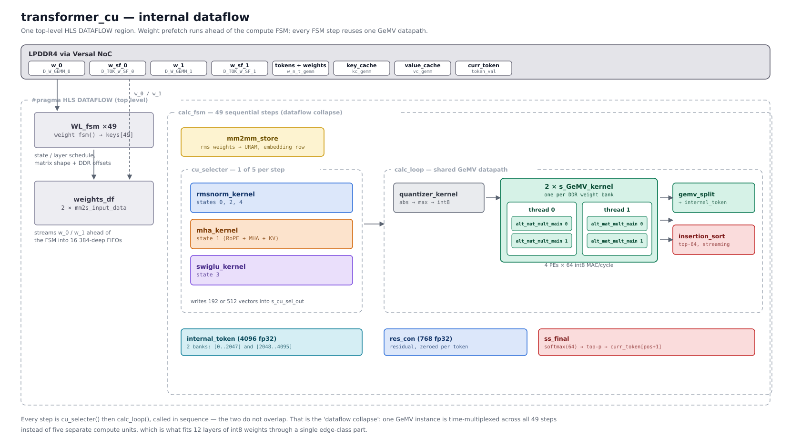
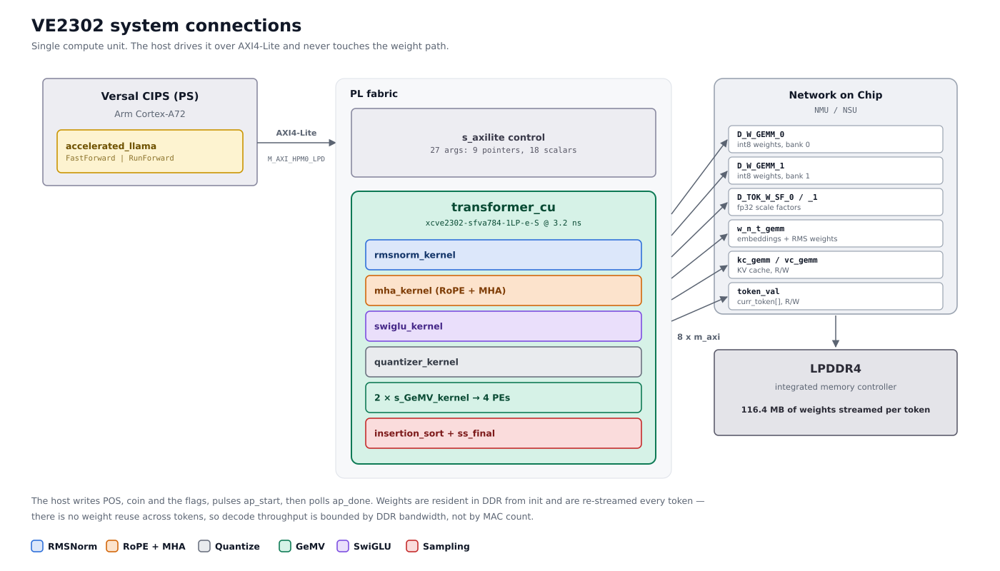

# HLS_llama

Int8 LLaMA-2 inference on a Versal AI Edge VE2302, written in Vitis HLS 2025.2. Thesis work at UT Dallas.

The whole transformer pass lives in **one** HLS kernel, `transformer_cu`, driven by a 49-step FSM. An Arm A72 host writes a position and a coin flip over AXI4-Lite, pulses `ap_start`, and reads the sampled token back out of DDR. Everything else — RMSNorm, RoPE, MHA, quantization, all five GeMV shapes, SwiGLU, and the sampler — is in the PL.

Target model is `stories110M` exported at int8 with group size 64: dim 768, hidden 2048, 12 layers, 12 heads, vocab 32 000, seq 1024.

**Pardon the dust — this is a work in progress.**

---

## Inspiration and what is different

This project started from Andrej Karpathy's [llama2.c](https://github.com/karpathy/llama2.c), specifically [`runq.c`](https://github.com/karpathy/llama2.c/blob/master/runq.c), the int8 quantized single-file inference implementation. A copy lives in [`llama2_software/`](llama2_software/) and is the reference the hardware is checked against — run it with `-t 0` and diff the token stream.

`runq.c` is a faithful, readable description of the math. It is not a description of good hardware. The differences below are all deliberate trades.



**Q, K and V are one GeMV.** `runq.c` issues three 768×768 `matmul` calls against the same activation vector. Hardware issues one 768×2304 call, because the three weight matrices are contiguous in DDR and splitting them buys nothing but descriptor overhead.

**W1 and W3 are one GeMV.** Same argument: one 768×4096 call instead of a gate pass and an up pass. SwiGLU then reads the two halves directly out of the dual-bank activation buffer.

**The residual add is folded into RMSNorm.** `x += xb2` is not a separate pass over 768 floats; `res_con += diff` happens as the norm accumulates, so the residual costs no extra DDR traffic and no extra loop.

**RoPE is a dataflow stage inside MHA.** `runq.c` rotates `q` and `k` in a standalone loop before attention. Here `rope_kernel` sits between the cache reader and the score loop in the same dataflow region, so the rotation never touches a memory.

**Softmax normalization is deferred.** Attention accumulates unnormalized `exp` weights against the value cache and scales once at the end, which removes a full pass over the score vector per head.

**Sampling keeps a running top-64.** `runq.c` softmaxes all 32 000 logits, `qsort`s a 32 000-entry `ProbIndex` array, then truncates to the nucleus. Here a 64-deep insertion sort streams alongside the classifier GeMV, so there is no probability buffer and no sort pass at all — softmax runs over the 64 survivors only. Probabilities are therefore renormalized over the top-64 rather than the full vocabulary, which is the one place the hardware is not numerically equivalent.

**The activation buffer is split across two banks.** `internal_token` is partitioned into `[0..2047]` and `[2048..4095]` so the two GeMV threads write to different BRAM banks without arbitration. Every producer and consumer in the kernel knows about the split, including the head-boundary arithmetic in MHA.

**Prefill is a truncated FSM.** Prompt tokens run 46 steps instead of 49, stopping after the last attention block. The KV cache gets filled; the classifier never runs.

What is *not* different: the int8 group quantization is bit-for-bit `runq.c`'s. Groups of 64 accumulate in int32 and are scaled by `tok_sf * w_sf` in the same low-to-high order, so a greedy run should match the reference token for token.

---

## Chapter 1 — `transformer_cu`

The kernel. Vitis HLS 2025.2, `xcve2302-sfva784-1LP-e-S`, 3.2 ns target.



### Structure

One top-level `DATAFLOW` region with three processes:

| Process | File | Role |
|---|---|---|
| `WL_fsm` → `weight_fsm()` | `transformer_kernel.cpp` | Builds the 49-step schedule: state, layer, matrix shape, DDR offsets. |
| `weights_df()` | `transformer_kernel.cpp` | Streams `w_0` / `w_1` ahead of the FSM into 16 384-deep FIFOs. |
| `calc_fsm()` | `transformer_kernel.cpp` | Runs the 49 steps. |

Each step is `cu_selecter()` followed by `calc_loop()`, called in sequence. They do not overlap — that is the "dataflow collapse" the branch was named for. One GeMV datapath is time-multiplexed across all 49 steps rather than instantiating five separate compute units, which is what makes 12 layers fit on an edge-class part.

### The five states

| State | Pre-op | GeMV | Shape |
|---|---|---|---|
| 0 | `rmsnorm_kernel` + residual | Q\|K\|V fused | 768 × 2304 |
| 1 | `mha_kernel` (RoPE + MHA + KV cache) | Output projection | 768 × 768 |
| 2 | `rmsnorm_kernel` + residual | W1\|W3 fused | 768 × 4096 |
| 3 | `swiglu_kernel` | W2 down projection | 2048 × 768 |
| 4 | `rmsnorm_kernel` (final) | Classifier | 768 × 32 000 |

States 0–3 run 12 times, state 4 once. Every state feeds `quantizer_kernel` before its GeMV, so the int8 path is identical everywhere.

### GeMV

`calc_loop` fans the quantized activation to two `s_GeMV_kernel` instances, one per DDR weight bank. Each splits again into two `alt_mat_mult_main` PEs. Four PEs, 64 int8 MACs each.

Weight offsets are computed as `CURR_LAYER * mm_thr + thread`, so thread 0 reads the first half of a layer's matrix and thread 1 the second half. `gemv_split` writes thread 0's rows to the low bank of `internal_token` and thread 1's to the high bank; `rr_merge` restores row order.

### Sampling

`gemv_split` also pushes every logit into `insertion_sort` as a `{index, prob}` pair. The sort keeps a descending 64-entry register file and runs concurrently with the classifier GeMV. `ss_final` then softmaxes those 64, applies temperature, and does the top-p draw. `temperature <= 0` short-circuits to `reg[0].index`, which is a true argmax over the full vocabulary and is the mode to use when diffing against `runq.c`.

### Files

```
transformer_kernel.cpp   top function, FSM, weight prefetch, calc_loop
mha.cpp / mha_forward.h  RoPE, MHA, KV cache, stream plumbing, model constants
matmult.cpp              alt_mat_mult_main, s_GeMV_kernel
quantizer.cpp / .h       fp32 -> int8, GS 64
rmsnorm.cpp / .h         RMSNorm with fused residual
swiglu_kernel.cpp        SwiGLU
combiner.h               gemv_split, insertion_sort, ss_final
hls_config.cfg           part, clock, file list, csim/cosim settings
testbench/               top_tb.cpp, tb_main.*, golden vectors
```

### Build

```sh
cd transformer_cu
v++ -c --mode hls --config hls_config.cfg
```

`csim` and `cosim` both need the golden vectors under `testbench/newgolden` and a `stories110M` int8 checkpoint. Note that `cosim` allocates every `m_axi` port at its declared `depth`; the weight and embedding ports dominate, so reduce `MODEL_SEQUENCE_LEN` for a short-prompt test if you are memory constrained.

---

## Chapter 2 — `accelerated_llama`

The host. XRT, C++17, runs on the A72 under PetaLinux.



### Two engines, one API

`compute_units.h` provides two classes with an identical public interface:

- **`FastForward`** — bare-metal AXI4-Lite via `xrt::ip`. Device addresses are written into the offset registers by hand and the memory bank for every buffer is chosen by the caller. Lowest overhead, no XRT validation.
- **`RunForward`** — managed flow via `xrt::kernel` / `xrt::run`. XRT resolves argument-to-bank connectivity from the xclbin, so buffers land in the right DDR automatically and a misconnected pointer throws instead of reading garbage. Bring up with this one.

Both expose `seed_prompt()`, `set_token()`, `set_temperature()`, `set_rms_flag()`, `enable_prefill()` / `enable_decode()`, `startForward(pos, coin)` and `endForward(pos)`.

`generate_loop.h` holds a templated `newgen()` that drives either engine, so the engine is a `-e` flag rather than a rebuild.

### The token array

`curr_token` is an `m_axi` array of `MODEL_SEQUENCE_LEN` ints, not an AXI-Lite scalar. Per step:

1. host writes `curr_token[pos]`, syncs the 4 KB buffer to device
2. `startForward` writes `POS` and `coin`, asserts `ap_start`
3. kernel reads `curr_token[POS]`, and in decode writes `curr_token[POS+1]`
4. `endForward` waits on `ap_done`, syncs from device, returns `curr_token[pos+1]`

During prefill the kernel does not write, so `endForward` hands back the prompt token the host already seeded. One code path covers both phases.

### Checkpoint handling

`llama_ckpt::read_header()` validates the v2 header against the geometry the kernel was synthesized for and throws on any mismatch — dim, hidden_dim, layers, heads, vocab, group size, and `shared_classifier`, since the kernel drives the LM head from `Embed_W`.

`parse_weights()` then repacks the checkpoint into three device blobs, de-interleaving `wq`/`wk`/`wv` so each layer's QKV is contiguous and hopping the W2 block to pair W1 with W3. The embedding table is dequantized in place out of the int8 blob rather than re-read from disk.

### Running

```sh
./accelerated_llama <checkpoint.bin> <bitstream.xclbin> [options]
```

| Flag | Meaning |
|---|---|
| `-i <string>` | prompt |
| `-n <int>` | steps (default 256) |
| `-t <float>` | temperature; `0` is greedy and is the mode that should match `runq.c` |
| `-s <int>` | RNG seed |
| `-e ip \| kernel` | engine select |
| `-d <int>` | XRT device index |
| `-g` / `-G <int>` | memory banks for the `xrt::ip` path; `-G` duplicates the weight blob into a second bank |

`-p` is parsed and ignored: `ss_final` hardcodes top-p at 0.9.

### Build

```sh
cd accelerated_llama
cmake -B build -DCMAKE_TOOLCHAIN_FILE=<petalinux sysroot toolchain>
cmake --build build
```

---

## Performance notes

116.4 MB of weights cross DDR every token — 109.5 MB of int8 plus 6.8 MB of fp32 scale factors — and none of it is reused between tokens. Four PEs at II=1 would ask for 76.8 GB/s at 312 MHz, which no LPDDR4 on this part will supply. Decode throughput is bounded by memory bandwidth, not by MAC count, and the useful optimizations are the ones that move fewer bytes rather than the ones that add compute.

---

## License

MIT. See [LICENSE](LICENSE).
